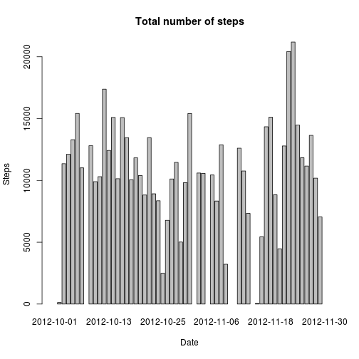
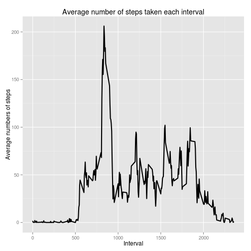
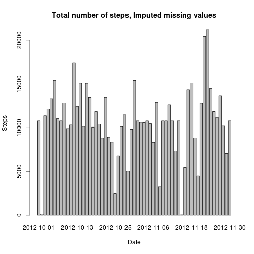
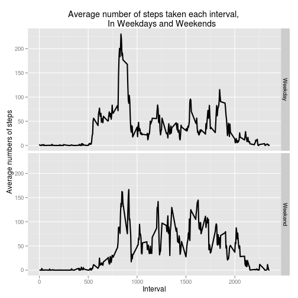

# Reproducible Research: Peer Assessment 1


## Loading and preprocessing the data


```r
if(!"activity.csv" %in% list.files("./data/")){
  dir.create("data")
  fileurl<-"https://d396qusza40orc.cloudfront.net/repdata%2Fdata%2Factivity.zip"
  download.file(fileurl, destfile = "./data/repdataactivity.zip")
  unzip(zipfile = "./data/repdataactivity.zip", exdir = "./data")
  rm(fileurl)
}

library(data.table)
library(ggplot2)
activity.data<-as.data.table(read.csv(file = "data//activity.csv", header=T))
```


## What is mean total number of steps taken per day?


```r
step.sums<-activity.data[, sum(steps), by=date]
setnames(step.sums, "V1", "steps")
barplot(height = step.sums$steps, names.arg = step.sums$date, 
        xlab="Date", ylab="Steps", main = "Total number of steps")
```

 

```r
hist(step.sums$steps)
```

 

```r
step.sums.mean<-step.sums[, mean(steps, na.rm=T)]
step.sums.median<-step.sums[, median(steps, na.rm=T)]
```

The mean of total number of steps taken per day is 1.0766 &times; 10<sup>4</sup> and median is 10765.

## What is the average daily activity pattern?


```r
step.interval<-activity.data[, mean(steps, na.rm=T), by=interval]
setnames(step.interval, "V1", "steps")
interval.plot<-ggplot(data = step.interval, aes(x = interval, y = steps))
interval.plot+geom_line(size=1)+
  labs(title="Average number of steps taken each interval", 
       x="Interval", y="Average numbers of steps")
```

 

```r
step.interval.mas<-step.interval[, step.interval$interval[steps==max(steps)]]
```

Interval that step is highest is 835.

## Imputing missing values


```r
num.nas<-table(complete.cases(activity.data))
filled.data<-activity.data
filled.data<-merge(filled.data, step.interval, by='interval', suffixes = c("",".m"))
filled.data$steps<-ifelse(is.na(filled.data$steps), 
                          filled.data$steps.m, 
                          filled.data$steps)
step.sums.filled<-filled.data[, sum(steps), by=date]
setnames(step.sums.filled, "V1", "steps")
barplot(height = step.sums.filled$steps, names.arg = step.sums.filled$date, 
        xlab="Date", ylab="Steps", main = "Total number of steps, Imputed missing values")
```

 

```r
hist(step.sums.filled$steps)
```

 

```r
step.sums.filled.mean<-step.sums.filled[, mean(steps)]
step.sums.filled.median<-step.sums.filled[, median(steps)]
```

The mean of total number of steps taken per day is 1.0766 &times; 10<sup>4</sup> and median is 1.0766 &times; 10<sup>4</sup>.

## Are there differences in activity patterns between weekdays and weekends?


```r
#"토요일", "일요일" are korean.
filled.data$Week<-as.factor(
                  ifelse(weekdays(as.Date(filled.data$date)) %in% c("토요일", "일요일"), 
                         "Weekend", "Weekday"))
step.interval.filled<-filled.data[, mean(steps), by=c("interval","Week")]
setnames(step.interval.filled, "V1", "steps")
interval.plot.filled<-ggplot(data = step.interval.filled, aes(x = interval, y = steps))
interval.plot.filled+geom_line(size=1)+
  labs(title="Average number of steps taken each interval, 
      In Weekdays and Weekends", 
       x="Interval", y="Average numbers of steps")+facet_grid(Week~.)
```

 

